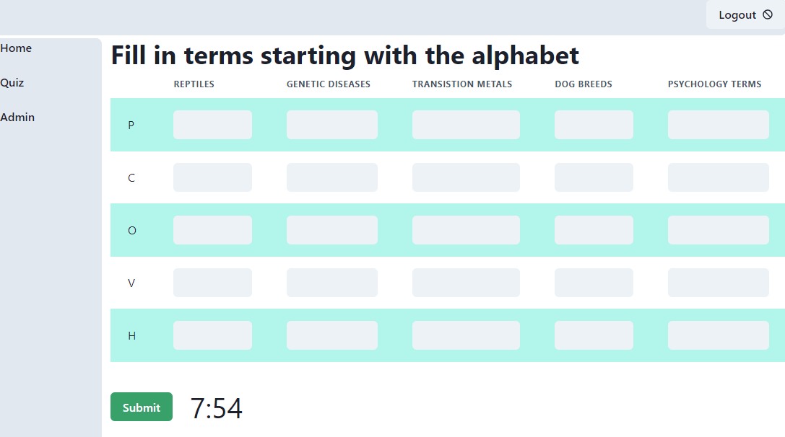

# Alphabet Quizzer

A full stack application that generates a quiz for alphabet/topic combinations.





## Features

* Create new user and login/ logout.
* Home: Create a new quiz by selecting topics and time (both optional)
* Quiz: The quiz page with

   * Countdown timer
   * Answer checking and gives the correct answers

* Admin: Add/ update topics

## Setup

Need to have docker and node installed. Pull the mongodb image.

1. Clone the git repository:

```shell
git clone https://github.com/sandhya-sago/alphabet_quiz.git
```

2. Bring up MongoDB

```shell
docker compose up
```

2a. Optional, initialize MongoDB (if you have a csv with topics as columns and alphabets as rows)

```shell
./server/bin/initialize_data.js -f <path>/alphabet_quiz.csv
```

3. Bring up server (need to install only when package.json changes)

```shell
cd server
npm install
npm run dev
```

4. Bring up client (need to install only when package.json changes)

```shell
cd client
npm install
npm run dev
```